

Welcome to my GitHub profile. Feel free to explore my projects and contact me if you have any questions or suggestions for cooperation. Have a nice day and easy exploration of my profile.

- 🔭 Currently working on **crafting digital experiences and coding my way through exciting projects.**
- 👯 I’m open to **new collaborations and projects, and I'm ready for challenges.**
- 🤔 Looking for help with **exploring new coding horizons, collaborating on innovative projects, and sharing insights on the latest tech trends.**
- 💬 Ask me about **my experience in sales which helps me in web development! I'm also happy to chat about web development👨‍💻, the gym💪, Apple🍏, and anything related to new and exciting experiences.**
- 📫 How to reach me: **131313light@gmail.com**

### Languages and Tools:

	
	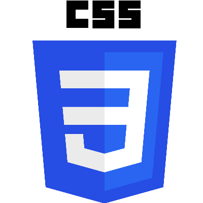
	
	
	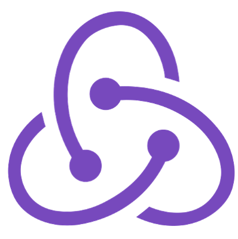
	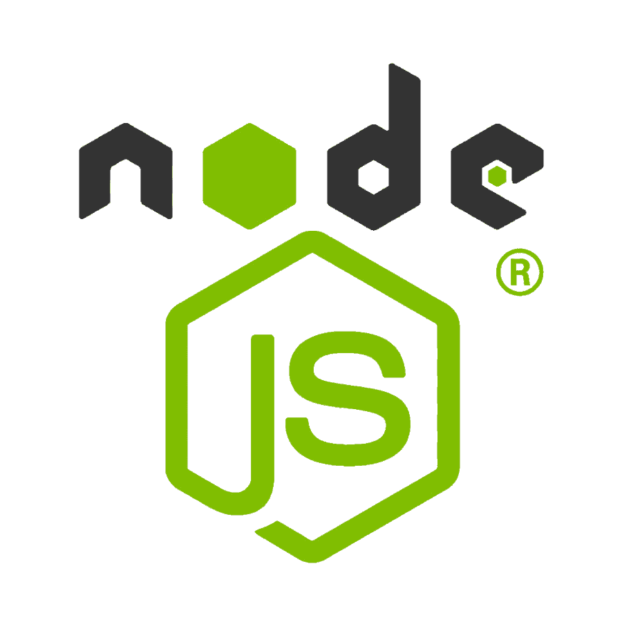
	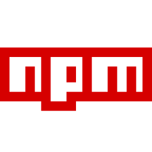
	
	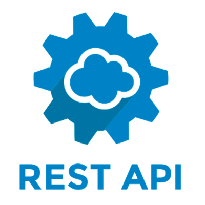
	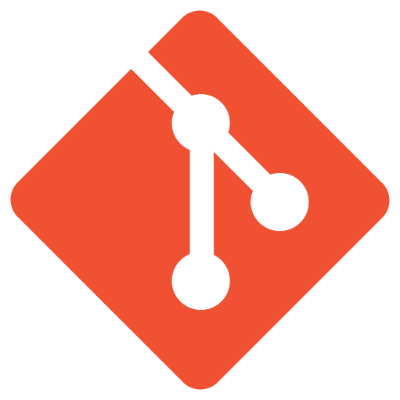
	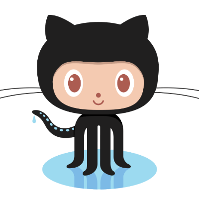
	
	
	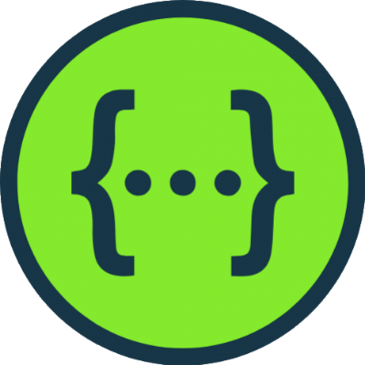
	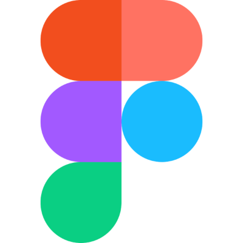
	
	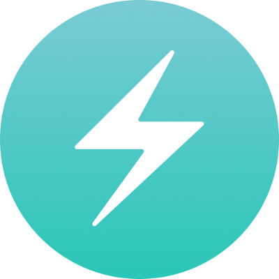
	
	
	
	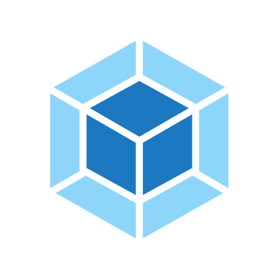
	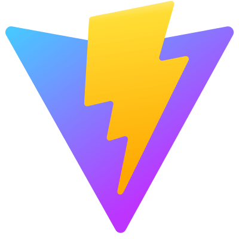
	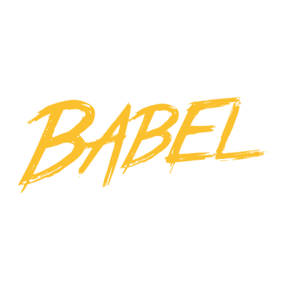

### Learning:

	
	
    

---

    
    
    

