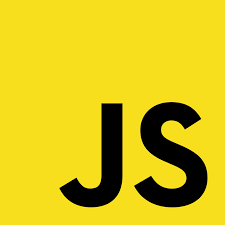

Welcome to my GitHub profile. Feel free to explore my projects and connect with me. If you have any questions or just want to chat about coding, don't hesitate to reach out. Happy coding!

- 🔭 I’m currently working on **crafting digital experiences and coding my way through exciting projects.**
- 👯 I’m open to **new collaborations and projects, and I'm ready for challenges.**
- 🤔 I’m looking for help with **exploring new coding horizons, collaborating on innovative projects, and sharing insights on the latest tech trends.**
- 💬 Ask me about **my journey from the high seas as a ship officer to the world of web development! I'm also happy to chat about HTML, CSS, JavaScript, React and anything related to creating exciting user experiences.**
- 📫 How to reach me: **131313light@gmail.com**

### Languages and Tools:

	
	
	
	
	
	
	
	
	
	
	
	
	
	
	
	
	
	
	
	
	
	
	

### Learning:

	
	
    

---

<!--  -->
<!--   -->

